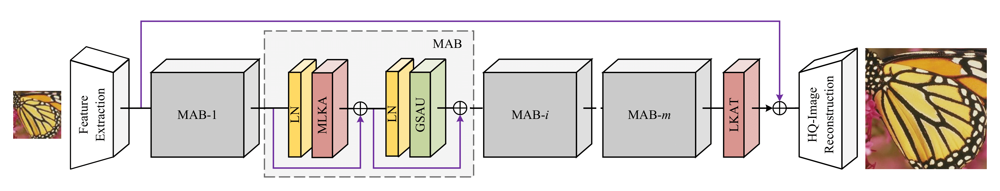
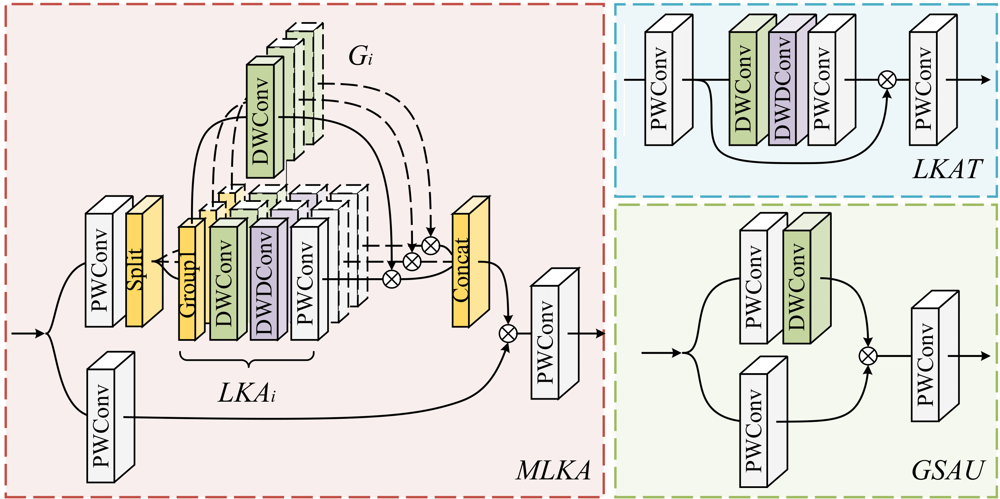
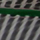
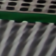
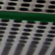
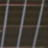
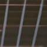
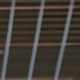
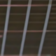
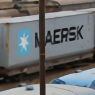

# MAN
### Codes for paper "[Multi-scale Attention Network for Single Image Super-Resolution](https://arxiv.org/abs/2209.14145)".

```
@article{wang2022multi,
  title={Multi-scale Attention Network for Single Image Super-Resolution},
  author={Wang, Yan and Li, Yusen and Wang, Gang and Liu, Xiaoguang},
  journal={arXiv preprint arXiv:2209.14145},
  year={2022}
}
```
---
## Environment
- [PyTorch >= 1.8](https://pytorch.org/)
- [BasicSR >= 1.3.5](https://github.com/xinntao/BasicSR-examples/blob/master/README.md) 


## Implementary Details
**Network architecture**: Group number (n_resgroups): **1 for simplicity**, MAB number (n_resblocks): **5/24/36**, channel width (n_feats): **48/60/180** for **tiny/light/base MAN**.
<p align="center">
     <br /></p>
    <em> Overview of the proposed MAN constituted of three components: the shallow feature extraction module (SF), the deep feature extraction module (DF) based on
    multiple multi-scale attention blocks (MAB), and the high-quality image reconstruction module. </em>
 
 &nbsp;

**Component details:** three multi-scale decomposition modes are utilized in MLKA. The 7×7 depth-wise convolution is used in the GSAU.
<p align="center">
     <br /></p>
    <em> Details of Multi-scale Large Kernel Attention (MLKA), Gated Spatial Attention Unit (GSAU), and Large Kernel Attention Tail (LKAT). </em>
&nbsp;

## Training and Testing

The [BasicSR](https://github.com/XPixelGroup/BasicSR) framework is utilized to train our MAN, also testing. 

**Dataset:**
 - Training: [DIV2K](https://data.vision.ee.ethz.ch/cvl/DIV2K/) and [Flickr2K](http://cv.snu.ac.kr/research/EDSR/Flickr2K.tar).
 - Testing: [Set5](http://people.rennes.inria.fr/Aline.Roumy/results/SR_BMVC12.html), [Set14](https://sites.google.com/site/romanzeyde/research-interests), [B100](https://www2.eecs.berkeley.edu/Research/Projects/CS/vision/bsds/), [Urban100](https://sites.google.com/site/jbhuang0604/publications/struct_sr), and [Manga109](http://www.manga109.org/en/).

**Training with the example option:**

```
CUDA_VISIBLE_DEVICES=0,1,2,3,4,5,6,7 python -m torch.distributed.launch --nproc_per_node=8 --master_port=4321 train.py -opt options/trian_MAN.yml --launcher pytorch
```
**Tesing with the example option:**

```
python test.py -opt options/test_MAN.yml
```

The training/testing results will be saved in the `./experiments` and `./results` folders, respectively.  

## Results and Models

Pretrained models available at [Google Drive](https://drive.google.com/drive/folders/1sARYFkVeTIFVCa2EnZg9TjZvirDvUNOL?usp=sharing) and [Baidu Pan](https://pan.baidu.com/s/15CTY-mgdTuOc1I8mzIA4Ug?pwd=mans) (pwd: **mans** for all links).

|HR (x4)|MAN-tiny|[EDSR-base+](https://github.com/sanghyun-son/EDSR-PyTorch)|MAN-light|[EDSR+](https://github.com/sanghyun-son/EDSR-PyTorch)|MAN|
|       :-----       |       :-----:       |     :-----:        |        :-----:         |        :-----:         |        :-----:         |
| | |||||
| | |||||
| | |||||
| | |||||
|**Para/MAdds**| 150K/8G|1518K/114G|840K/47G|43090K/2895G|8712K/495G|

Results of our MAN-tiny/light/base models. Set5 validation set is used below to show the general performance. The visual results of five testsets are provided in the last column.

| Methods  |  Params   |  Madds   |PSNR/SSIM (x2)|PSNR/SSIM (x3)|PSNR/SSIM (x4)|Results|
|:---------|:---------:|:--------:|:------:|:------:|:------:|:--------:|
| MAN-tiny |      150K |     8.4G | 37.91/0.9603  |       34.23/0.9258      | 32.07/0.8930  | [x2](https://pan.baidu.com/s/1mYkGvAlz0bSZuCVubkpsmg?pwd=mans)/[x3](https://pan.baidu.com/s/1RP5gGu-QPXTkH1NPH7axag?pwd=mans)/[x4](https://pan.baidu.com/s/1u22su2bT4Pq_idVxAnqWdw?pwd=mans)    |
| MAN-light|      840K |    47.1G | 38.18/0.9612  | 34.65/0.9292  | 32.50/0.8988  | [x2](https://pan.baidu.com/s/1AVuPa7bsbb3qMQqMSM-IJQ?pwd=mans)/[x3](https://pan.baidu.com/s/1TRL7-Y23JddVOpEhH0ObEQ?pwd=mans)/[x4](https://pan.baidu.com/s/1T2bPZcjFRxAgMxGWtPv-Lw?pwd=mans) |
| MAN+     |     8712K |     495G | 38.44/0.9623  | 34.97/0.9315  | 32.87/0.9030  | [x2](https://pan.baidu.com/s/1pTb3Fob_7MOxMKIdopI0hQ?pwd=mans)/[x3](https://pan.baidu.com/s/1L3HEtcraU8Y9VY-HpCZdfg?pwd=mans)/[x4](https://pan.baidu.com/s/1FCNqht9zi9HecG3ExRdeWQ?pwd=mans) |

## Acknowledgements

We would thank [VAN](https://github.com/Visual-Attention-Network/VAN-Classification) and [BasicSR](https://github.com/XPixelGroup/BasicSR) for their enlightening work!
